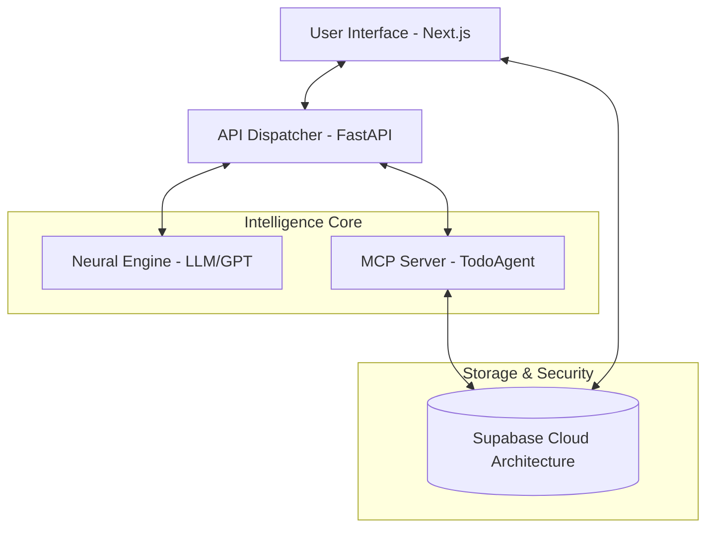

# 🤖 AI Agentixz USA — Elite AI-Powered Todo Operative

[](https://nextjs.org/)
[](https://fastapi.tiangolo.com/)
[](https://supabase.com/)
[](https://modelcontextprotocol.io/)
[](https://github.com/)

**AI Agentixz USA** is a world-class, high-fidelity task management ecosystem designed for elite productivity. It transforms simple todo lists into a cinematic orchestration platform, leveraging the **Model Context Protocol (MCP)** and advanced LLM understanding to manage your objectives via natural language and voice.

---

## 🌟 Elite Feature Suite

### 🧠 Intelligence Layer (Neural Engine v3.8)
- **Semantic Intent Extraction**: Powered by OpenAI, the system dynamically parses unstructured text into structured "Mission Objectives."
- **Bilingual Protocol**: Native support for **English** and **Urdu**, with real-time translation and cultural context preserved during task synchronization.
- **Voice-to-Mission Conversion**: Direct deployment of tasks via vocal directives.

### ⚡ Tactical Mission Control
- **Mission Respawn (Recurrence)**: Automated cycle management for Daily, Weekly, and Monthly recurring objectives.
- **Priority Protocol**: Urgent, High, Medium, and Low priorities with specialized color-coding and filtering.
- **Mission Duration (Timer)**: Real-time mission clocks synchronized across the cloud to track tactical efficiency.
- **Bulk Deployment**: Batch-process multiple objectives in a single transmission.

### 🎨 Cinematic Interface
- **Premium Visualization**: High-fidelity "Mission Progress" circular gauges and "Tactical Distribution" bar charts.
- **Ultra-Responsive Layout**: Professional-grade responsiveness across mobile, tablet, and desktop displays.
- **Micro-Animations**: Fluid transitions and interactive feedback powered by **Framer Motion**.
- **Indigo Theme**: A curated, premium dark-mode aesthetic for reduced ocular strain during long-haul productivity.

---

## 🏗 System Architecture



---

## 📡 MCP Tool Library (TodoAgent)

The system utilizes the **Model Context Protocol** to standardize interactions with the objective database:

| Tool | Capability |
| :--- | :--- |
| `add_todo` | Deploys a new objective with title, priority, and recurrence. |
| `add_todos_bulk` | Orchestrates a batch deployment of multiple objectives. |
| `list_todos` | Retrieves all active missions from the tactical archives. |
| `toggle_todo` | Switches mission status and triggers "Mission Respawn." |
| `manage_timer` | Controls the "Mission Clock" (Start/Stop) for time tracking. |
| `delete_todo` | Erases an objective from the neural net. |

---

## 🛠 Technical Stack

- **Frontend**: `Next.js 15`, `Tailwind CSS 4`, `Framer Motion`, `Lucide React`, `Better Auth`.
- **Backend**: `FastAPI`, `Uvicorn`, `Python-dotenv`.
- **Cloud/Data**: `Supabase` (PostgreSQL, Auth, RLS).
- **Communication**: `Model Context Protocol (MCP)`, `FastMCP`.
- **Logic**: `Python 3.10+`, `TypeScript`.

---

## 🚀 Deployment & Installation

### 1. Database Initialization
Execute the SQL protocols in your Supabase Editor:
1. [`database_init.sql`](file:///d:/github/Hackathon-II-Phase-III-PRO-AI-Powered-Todo-Chatbot/database_init.sql) — Basic Table & RLS.
2. [`database_upgrade.sql`](file:///d:/github/Hackathon-II-Phase-III-PRO-AI-Powered-Todo-Chatbot/database_upgrade.sql) — Advanced Analytics & Timing.

### 2. Neural Backend Setup
```bash
cd backend
pip install -r requirements.txt
# Configure .env with SUPABASE_URL, ANON_KEY, and OPENAI_API_KEY
python -m uvicorn app.main:app --reload --port 8000
```

### 3. Frontend Deployment
```bash
cd frontend
npm install
# Configure .env.local with NEXT_PUBLIC_SUPABASE_URL and NEXT_PUBLIC_API_URL
npm run dev
```

---

## 🛡 Security Protocol
Architected with **Row Level Security (RLS)**, ensuring objective isolation. No data leakage occurs between operatives; your tactical plans remain your own.

---

## ✍️ Credits & Hackathon Status
Developed for **Hackathon II — Phase III PRO**. 
**Status**: Combat Ready. 🚀🇺🇸
